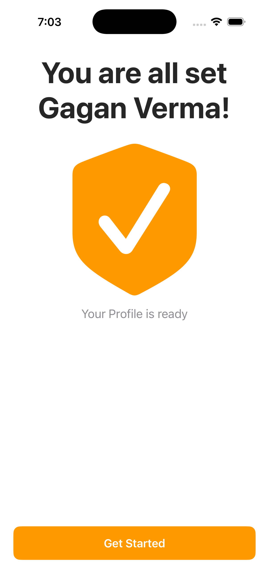
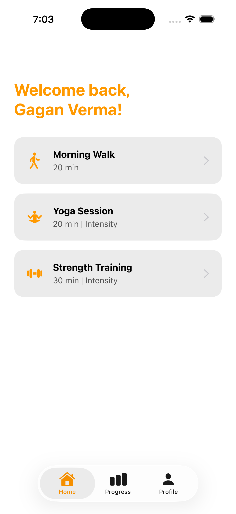
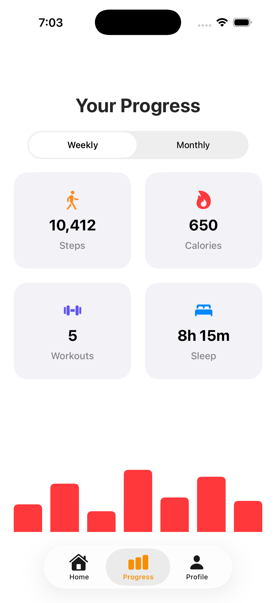
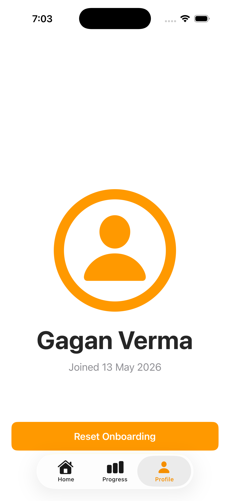

# 🏃 FitLife Onboarding App — iOS App
> App #2 of my iOS Development Journey | Built with Swift + UIKit | Zero Storyboards
 
## 📱 Overview
A fully programmatic iOS fitness onboarding app with a 3-page swipeable flow, root VC switching, and a 3-tab home experience.
 
---
 
## 🖥️ Screenshots
 
| Onboarding | Home Tab | Progress Tab | Profile Tab |
|---|---|---|---|
|  |  |  |  |
 
---
 
## 🖥️ Screens
- **Onboarding (3 pages)** — Welcome, Features, Name input with validation · swipe + button navigation
- **Get Started** — Personalized welcome, transitions to tab bar · shown only once
- **Home Tab** — User name + 3 workout activity cards
- **Progress Tab** — 2×2 stats grid + custom `BarChartView` + Weekly/Monthly toggle
- **Profile Tab** — Name, date joined, Reset Onboarding with `CATransition`
## ⚙️ Features
| Feature | Detail |
|---|---|
| Swipe onboarding | `UIPageViewController` + gesture + button nav |
| Onboarding skip | `SceneDelegate` checks `UserDefaults` on launch |
| Root VC switching | `UIWindowScene` swaps onboarding ↔ tab bar |
| Custom bar chart | `BarChartView` — `UIView` subclass + `UIStackView` |
| Reset with animation | `CATransition` on root VC switch |
 
## 🛠️ Tech Stack
Swift · UIKit · Programmatic UI · `UIPageViewController` · `UITabBarController` · `UICollectionView` + Compositional Layout · `CATransition` · `UserDefaults` · `SceneDelegate`
 
## 🧠 Concepts Practiced
`UIPageViewController` · Closures for navigation · Root VC switching · `SceneDelegate` logic · Compositional Layout · Custom `UIView` subclass · `CATransition` · `DateFormatter` · `UserDefaults` multi-value
 
## 🚀 Getting Started
```bash
git clone https://github.com/vermagagan/FitLife-iOS.git
```
Open `FitLife.xcodeproj` in Xcode · Run on iOS 16+ · No dependencies.
 
## 👨‍💻 Author
**vermagagan** · Aspiring iOS Developer · Building in public
[](https://linkedin.com/in/vermagagan) [](https://github.com/vermagagan)
 
> *"10 files, 3 tabs, a custom chart, and zero storyboards. This was the app that made navigation architecture finally click."*
